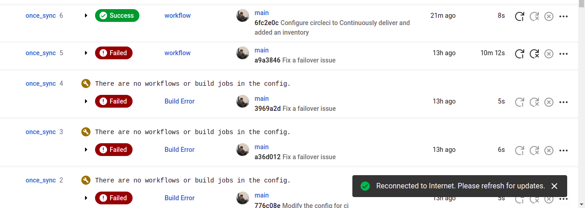

# once_sync
DevOps Test

## CICD platform
#### Integrated with circleci.
## loadbalancer
)n the part of load balancer I used Nginx its file is in the .circleci directory.
## Deployment Cloud Platform
#### Used Linode servers
#### Used domain names from duckdns which are free

## Server Provisioning
#### Used Ansible for server provisioning and deployment of the project.

All the pipelines are as indicated in the 
.circleci folder and an inventory hosts and playbook.yml

 